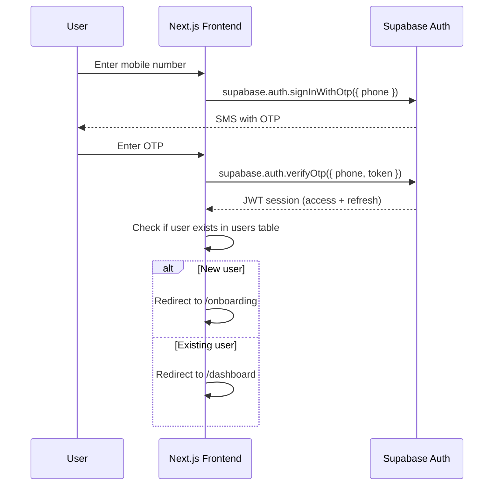

# Phase 1 — Foundation & Authentication

| Field | Value |
|---|---|
| Phase | 1 of 4 |
| Status | Draft |
| Stack | Next.js (App Router) + Supabase (Postgres + Auth) |
| Duration | ~2–3 weeks |
| Depends on | — (first phase) |
| Unlocks | Phase 2 (Profiles & Directories) |

---

## 1. Objective

Stand up the **core infrastructure** — database schema, authentication, user registration, multi-role management, and reference data — so every subsequent phase builds on a stable, tested foundation.

---

## 2. Scope

### In Scope

| Area | Deliverables |
|---|---|
| **Database** | Full Supabase Postgres schema: `users`, `user_roles`, `otp_verifications`, `countries`, `states`, `cities`, `categories`, `platform_config` |
| **Auth** | OTP-based mobile auth via Supabase Auth (SMS provider) + JWT sessions |
| **Registration** | Signup flow: Name, Mobile, Country → State → City, optional email, role selection |
| **Multi-role** | `user_roles` CRUD — add/remove `influencer` / `provider` roles post-signup |
| **Reference data** | Seed countries, states, cities (India focus); seed categories; seed `platform_config` |
| **RLS policies** | Row-Level Security on all tables |
| **Project scaffold** | Next.js App Router project, Supabase client setup, env config |

### Out of Scope

- Business profiles, influencer profiles (Phase 2)
- Opportunities, applications (Phase 3)
- Admin panel (Phase 4)

---

## 3. Database Schema

### 3.1 Location Tables

```sql
-- countries
CREATE TABLE countries (
  id        BIGINT GENERATED ALWAYS AS IDENTITY PRIMARY KEY,
  name      VARCHAR(100) NOT NULL,
  iso_code  VARCHAR(3)   NOT NULL UNIQUE,
  phone_code VARCHAR(6)  NOT NULL
);

-- states
CREATE TABLE states (
  id         BIGINT GENERATED ALWAYS AS IDENTITY PRIMARY KEY,
  country_id BIGINT NOT NULL REFERENCES countries(id),
  name       VARCHAR(100) NOT NULL
);
CREATE INDEX idx_states_country ON states(country_id);

-- cities
CREATE TABLE cities (
  id       BIGINT GENERATED ALWAYS AS IDENTITY PRIMARY KEY,
  state_id BIGINT NOT NULL REFERENCES states(id),
  name     VARCHAR(100) NOT NULL
);
CREATE INDEX idx_cities_state ON cities(state_id);
```

### 3.2 Categories

```sql
CREATE TABLE categories (
  id        BIGINT GENERATED ALWAYS AS IDENTITY PRIMARY KEY,
  parent_id BIGINT REFERENCES categories(id),
  name      VARCHAR(100) NOT NULL,
  slug      VARCHAR(120) NOT NULL UNIQUE,
  is_active BOOLEAN NOT NULL DEFAULT true,
  created_at TIMESTAMPTZ NOT NULL DEFAULT now()
);
CREATE INDEX idx_categories_parent ON categories(parent_id);
```

### 3.3 Users

```sql
CREATE TABLE users (
  id              UUID PRIMARY KEY DEFAULT gen_random_uuid(),
  name            VARCHAR(120) NOT NULL,
  email           VARCHAR(180) UNIQUE,
  mobile_number   VARCHAR(20)  NOT NULL UNIQUE,
  mobile_verified BOOLEAN NOT NULL DEFAULT false,
  country_id      BIGINT NOT NULL REFERENCES countries(id),
  state_id        BIGINT NOT NULL REFERENCES states(id),
  city_id         BIGINT NOT NULL REFERENCES cities(id),
  avatar_url      VARCHAR(500),
  status          VARCHAR(20) NOT NULL DEFAULT 'active'
                  CHECK (status IN ('active','pending','suspended')),
  created_at      TIMESTAMPTZ NOT NULL DEFAULT now(),
  updated_at      TIMESTAMPTZ NOT NULL DEFAULT now()
);
```

### 3.4 User Roles

```sql
CREATE TABLE user_roles (
  id               BIGINT GENERATED ALWAYS AS IDENTITY PRIMARY KEY,
  user_id          UUID NOT NULL REFERENCES users(id) ON DELETE CASCADE,
  role             VARCHAR(20) NOT NULL
                   CHECK (role IN ('influencer','provider','admin')),
  provider_subtype VARCHAR(30)
                   CHECK (provider_subtype IN ('business_owner','freelancer','local_service')),
  granted_by       UUID REFERENCES users(id),
  created_at       TIMESTAMPTZ NOT NULL DEFAULT now(),
  UNIQUE(user_id, role)
);
CREATE INDEX idx_user_roles_user ON user_roles(user_id);
CREATE INDEX idx_user_roles_role ON user_roles(role);
```

### 3.5 Platform Config

```sql
CREATE TABLE platform_config (
  key         VARCHAR(80) PRIMARY KEY,
  value       VARCHAR(255) NOT NULL,
  description VARCHAR(255),
  updated_by  UUID REFERENCES users(id),
  updated_at  TIMESTAMPTZ NOT NULL DEFAULT now()
);

-- Seed values
INSERT INTO platform_config (key, value, description) VALUES
  ('max_business_profiles_per_provider', '5', 'Max business profiles a provider can create'),
  ('max_opportunity_duration_days', '30', 'Max opportunity visibility window in days');
```

### 3.6 OTP Verifications (audit only)

```sql
CREATE TABLE otp_verifications (
  id            BIGINT GENERATED ALWAYS AS IDENTITY PRIMARY KEY,
  mobile_number VARCHAR(20) NOT NULL,
  purpose       VARCHAR(30) NOT NULL DEFAULT 'login',
  consumed_at   TIMESTAMPTZ,
  created_at    TIMESTAMPTZ NOT NULL DEFAULT now(),
  expires_at    TIMESTAMPTZ NOT NULL
);
```

---

## 4. Authentication Flow

### 4.1 OTP via Supabase Auth



### 4.2 Registration (Onboarding)

| Step | Fields | Validation |
|---|---|---|
| 1 — Basic Info | Name (required), Email (optional) | Name ≥ 2 chars |
| 2 — Location | Country → State → City (cascading) | All required |
| 3 — Role | Checkboxes: Influencer, Provider (with subtype) | Optional — skip = Customer |

### 4.3 API Routes

| Method | Route | Auth | Purpose |
|---|---|---|---|
| `POST` | `/api/auth/otp/request` | Public | Trigger Supabase phone OTP |
| `POST` | `/api/auth/otp/verify` | Public | Verify OTP, return session |
| `POST` | `/api/users` | Authenticated | Complete registration |
| `GET` | `/api/users/me` | Authenticated | Current user + roles |
| `PATCH` | `/api/users/me` | Authenticated | Update profile info |
| `POST` | `/api/users/me/roles` | Authenticated | Add a role |
| `DELETE` | `/api/users/me/roles/:role` | Authenticated | Remove a role |
| `GET` | `/api/locations/countries` | Public | List countries |
| `GET` | `/api/locations/states?country_id=` | Public | States by country |
| `GET` | `/api/locations/cities?state_id=` | Public | Cities by state |
| `GET` | `/api/categories` | Public | Active categories |

---

## 5. UI/UX Specifications

> Follows **ui-ux-pro-max** skill guidelines.

### 5.1 Design System Tokens

| Token | Value | Rationale |
|---|---|---|
| **Primary font** | `Inter` (Google Fonts) | Clean, modern marketplace feel |
| **Heading font** | `Outfit` | Geometric, pairs with Inter |
| **Base font size** | `16px` body | Avoids iOS auto-zoom |
| **Line height** | `1.5–1.75` body | Typography guideline |
| **Spacing scale** | `4px` increments (4/8/12/16/24/32/48) | Material 4pt system |
| **Border radius** | `8px` cards, `12px` modals, `9999px` pills | Consistent elevation |
| **Color mode** | Dark-first with light toggle | Desaturated tonal variants |
| **Max width** | `1280px` | Container guideline |
| **Breakpoints** | 375 / 768 / 1024 / 1440 | Consistent breakpoints |

### 5.2 Color Palette

| Role | Light | Dark |
|---|---|---|
| **Primary** | `hsl(245, 80%, 60%)` | `hsl(245, 70%, 65%)` |
| **Secondary** | `hsl(170, 65%, 45%)` | `hsl(170, 55%, 50%)` |
| **Surface** | `hsl(0, 0%, 100%)` | `hsl(230, 15%, 12%)` |
| **Background** | `hsl(230, 20%, 97%)` | `hsl(230, 18%, 8%)` |
| **Text Primary** | `hsl(230, 25%, 12%)` | `hsl(230, 15%, 92%)` |
| **Error** | `hsl(0, 72%, 51%)` | `hsl(0, 65%, 60%)` |
| **Border** | `hsl(230, 15%, 88%)` | `hsl(230, 12%, 22%)` |

### 5.3 Key Page Specs

#### Login / OTP Page (`/login`)

- Centered card (max 420px), gradient background
- Phone input with country code prefix, `inputMode="tel"`
- Submit button: spinner during send (`loading-buttons` rule)
- 6-digit segmented OTP input with auto-focus advance
- Resend timer (30s countdown)
- Error below field (`error-placement`), `aria-live` for updates
- Entry animation: `translateY(20px)→0` + opacity, 300ms ease-out

#### Onboarding (`/onboarding`)

- Multi-step with progress indicator (`multi-step-progress`)
- Step transitions slide left/right, 300ms ease-out
- Inline validation on blur (`inline-validation`)
- Back navigation preserves state
- Role selection: card-style selectors with icons + descriptions
- Provider sub-type dropdown appears conditionally

---

## 6. Row-Level Security (RLS)

```sql
ALTER TABLE users ENABLE ROW LEVEL SECURITY;
CREATE POLICY "Users read own" ON users FOR SELECT USING (auth.uid() = id);
CREATE POLICY "Users update own" ON users FOR UPDATE USING (auth.uid() = id);

ALTER TABLE user_roles ENABLE ROW LEVEL SECURITY;
CREATE POLICY "Read own roles" ON user_roles FOR SELECT USING (auth.uid() = user_id);
CREATE POLICY "Add own role" ON user_roles FOR INSERT
  WITH CHECK (auth.uid() = user_id AND role IN ('influencer','provider'));

ALTER TABLE countries ENABLE ROW LEVEL SECURITY;
CREATE POLICY "Public read" ON countries FOR SELECT USING (true);

ALTER TABLE states ENABLE ROW LEVEL SECURITY;
CREATE POLICY "Public read" ON states FOR SELECT USING (true);

ALTER TABLE cities ENABLE ROW LEVEL SECURITY;
CREATE POLICY "Public read" ON cities FOR SELECT USING (true);

ALTER TABLE categories ENABLE ROW LEVEL SECURITY;
CREATE POLICY "Public read active" ON categories FOR SELECT USING (is_active = true);
```

---

## 7. Folder Structure

```
src/
├── app/
│   ├── (auth)/login/page.tsx
│   ├── (auth)/onboarding/page.tsx
│   ├── (public)/layout.tsx
│   ├── (dashboard)/layout.tsx
│   ├── api/auth/
│   ├── api/users/
│   ├── api/locations/
│   ├── api/categories/
│   ├── layout.tsx
│   └── page.tsx
├── components/
│   ├── ui/           -- Button, Input, Card, etc.
│   ├── auth/         -- OTPInput, PhoneInput
│   └── layout/       -- Navbar, Footer
├── lib/
│   ├── supabase/client.ts
│   ├── supabase/server.ts
│   └── supabase/admin.ts
├── hooks/useUser.ts, useRoles.ts
├── types/database.ts
└── styles/globals.css
```

---

## 8. Acceptance Criteria

| ID | Criterion |
|---|---|
| P1-AC01 | All database tables created with constraints & indexes |
| P1-AC02 | OTP sent to valid mobile within 5s |
| P1-AC03 | OTP verification returns valid JWT session |
| P1-AC04 | New user → onboarding; existing user → dashboard |
| P1-AC05 | Onboarding saves user with all required fields |
| P1-AC06 | Role selection creates correct `user_roles` rows |
| P1-AC07 | Cascading location dropdowns load < 300ms |
| P1-AC08 | Adding a role post-signup works without new account |
| P1-AC09 | RLS prevents cross-user data access |
| P1-AC10 | All inputs have visible labels, error feedback, correct `inputMode` |
| P1-AC11 | OTP page works on 375px mobile viewport |
| P1-AC12 | Seed data loaded for locations, categories, platform_config |

---

## 9. Risks & Mitigations

| Risk | Impact | Mitigation |
|---|---|---|
| SMS provider cost/limits | Auth blocked | Rate limiting; email OTP fallback |
| Large location dataset | Slow dropdowns | Paginated API + search for cities |
| Phone format inconsistency | Failed OTP | Normalize with `libphonenumber` |

---

*Next → [Phase 2: Profiles & Directories](./Phase_2_Profiles_Directories.md)*
