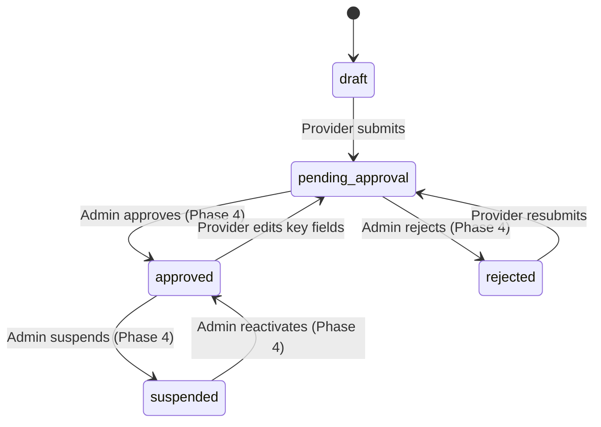

# Phase 2 — Profiles & Public Directories

| Field | Value |
|---|---|
| Phase | 2 of 4 |
| Status | Draft |
| Stack | Next.js (App Router) + Supabase (Postgres + Storage) |
| Duration | ~3–4 weeks |
| Depends on | Phase 1 (Foundation & Auth) |
| Unlocks | Phase 3 (Opportunities & Connections) |

---

## 1. Objective

Build the **two core profile systems** — Business Profiles (Services) and Influencer Profiles — along with their **public-facing directories**. This phase delivers the primary value proposition: a browsable marketplace of services and influencers.

---

## 2. Scope

### In Scope

| Area | Deliverables |
|---|---|
| **Business Profiles** | CRUD, media upload, approval workflow states (`draft → pending_approval → approved / rejected`), public listing |
| **Influencer Profiles** | CRUD, social account linking, follower counts (manual entry), profile picture enforcement, public listing |
| **Media** | Image/video upload to Supabase Storage, thumbnails, sort ordering |
| **Public Directories** | `/services` — approved business profiles; `/influencers` — published influencer profiles |
| **Contact Privacy** | Influencer contact number hidden from non-providers; reveal logged |
| **Search & Filter** | Category, location, keyword filters on both directories |

### Out of Scope

- Approval actions by admin (Phase 4 — Admin Panel)
- Opportunities and applications (Phase 3)
- Auto social sync via API (Phase 4 — background jobs)

---

## 3. Database Schema

### 3.1 Business Profiles

```sql
CREATE TABLE business_profiles (
  id               UUID PRIMARY KEY DEFAULT gen_random_uuid(),
  user_id          UUID NOT NULL REFERENCES users(id) ON DELETE CASCADE,
  provider_type    VARCHAR(30) NOT NULL
                   CHECK (provider_type IN ('business_owner','freelancer','local_service')),
  business_name    VARCHAR(150) NOT NULL,
  tagline          VARCHAR(200),
  description      TEXT NOT NULL,
  category_id      BIGINT NOT NULL REFERENCES categories(id),
  contact_type     VARCHAR(10) NOT NULL DEFAULT 'whatsapp'
                   CHECK (contact_type IN ('whatsapp','phone')),
  whatsapp_number  VARCHAR(20),
  contact_number   VARCHAR(20),
  website_url      VARCHAR(255),
  address_line     VARCHAR(255),
  country_id       BIGINT NOT NULL REFERENCES countries(id),
  state_id         BIGINT NOT NULL REFERENCES states(id),
  city_id          BIGINT NOT NULL REFERENCES cities(id),
  is_public        BOOLEAN NOT NULL DEFAULT true,
  status           VARCHAR(20) NOT NULL DEFAULT 'draft'
                   CHECK (status IN ('draft','pending_approval','approved','rejected','suspended')),
  rejection_reason VARCHAR(500),
  approved_by      UUID REFERENCES users(id),
  approved_at      TIMESTAMPTZ,
  created_at       TIMESTAMPTZ NOT NULL DEFAULT now(),
  updated_at       TIMESTAMPTZ NOT NULL DEFAULT now(),
  CHECK (whatsapp_number IS NOT NULL OR contact_number IS NOT NULL)
);

CREATE INDEX idx_bp_status_public ON business_profiles(status, is_public);
CREATE INDEX idx_bp_user ON business_profiles(user_id);
CREATE INDEX idx_bp_category ON business_profiles(category_id);
CREATE INDEX idx_bp_city ON business_profiles(city_id);
```

### 3.2 Business Media

```sql
CREATE TABLE business_media (
  id                  BIGINT GENERATED ALWAYS AS IDENTITY PRIMARY KEY,
  business_profile_id UUID NOT NULL REFERENCES business_profiles(id) ON DELETE CASCADE,
  media_type          VARCHAR(10) NOT NULL CHECK (media_type IN ('image','video')),
  url                 VARCHAR(500) NOT NULL,
  thumbnail_url       VARCHAR(500),
  sort_order          INTEGER NOT NULL DEFAULT 0,
  created_at          TIMESTAMPTZ NOT NULL DEFAULT now()
);
CREATE INDEX idx_bm_profile_sort ON business_media(business_profile_id, sort_order);
```

### 3.3 Profile Approvals

```sql
CREATE TABLE profile_approvals (
  id                  BIGINT GENERATED ALWAYS AS IDENTITY PRIMARY KEY,
  business_profile_id UUID NOT NULL REFERENCES business_profiles(id) ON DELETE CASCADE,
  reviewed_by         UUID NOT NULL REFERENCES users(id),
  decision            VARCHAR(10) NOT NULL CHECK (decision IN ('approved','rejected')),
  reason              VARCHAR(500),
  created_at          TIMESTAMPTZ NOT NULL DEFAULT now()
);
CREATE INDEX idx_pa_profile ON profile_approvals(business_profile_id);
```

### 3.4 Influencer Profiles

```sql
CREATE TABLE influencer_profiles (
  id                 UUID PRIMARY KEY DEFAULT gen_random_uuid(),
  user_id            UUID NOT NULL REFERENCES users(id) ON DELETE CASCADE UNIQUE,
  display_name       VARCHAR(120) NOT NULL,
  bio                TEXT,
  profile_picture_url VARCHAR(500) NOT NULL,
  niche_category_id  BIGINT REFERENCES categories(id),
  price_min          NUMERIC(12,2) NOT NULL,
  price_max          NUMERIC(12,2) NOT NULL,
  currency           CHAR(3) NOT NULL DEFAULT 'INR',
  contact_number     VARCHAR(20),   -- PRIVATE: provider-only
  country_id         BIGINT NOT NULL REFERENCES countries(id),
  state_id           BIGINT NOT NULL REFERENCES states(id),
  city_id            BIGINT NOT NULL REFERENCES cities(id),
  is_public          BOOLEAN NOT NULL DEFAULT true,
  status             VARCHAR(15) NOT NULL DEFAULT 'draft'
                     CHECK (status IN ('draft','published','suspended')),
  created_at         TIMESTAMPTZ NOT NULL DEFAULT now(),
  updated_at         TIMESTAMPTZ NOT NULL DEFAULT now(),
  CHECK (price_max >= price_min)
);

CREATE INDEX idx_ip_status_public ON influencer_profiles(status, is_public);
CREATE INDEX idx_ip_niche ON influencer_profiles(niche_category_id);
CREATE INDEX idx_ip_city ON influencer_profiles(city_id);
```

### 3.5 Influencer Social Accounts

```sql
CREATE TABLE influencer_social_accounts (
  id                    BIGINT GENERATED ALWAYS AS IDENTITY PRIMARY KEY,
  influencer_profile_id UUID NOT NULL REFERENCES influencer_profiles(id) ON DELETE CASCADE,
  platform              VARCHAR(15) NOT NULL
                        CHECK (platform IN ('instagram','youtube','facebook')),
  profile_url           VARCHAR(255) NOT NULL,
  external_id           VARCHAR(120),
  handle                VARCHAR(120),
  follower_count        BIGINT NOT NULL DEFAULT 0,
  count_source          VARCHAR(10) NOT NULL DEFAULT 'manual'
                        CHECK (count_source IN ('auto','manual')),
  is_verified           BOOLEAN NOT NULL DEFAULT false,
  last_synced_at        TIMESTAMPTZ,
  created_at            TIMESTAMPTZ NOT NULL DEFAULT now(),
  updated_at            TIMESTAMPTZ NOT NULL DEFAULT now(),
  UNIQUE(influencer_profile_id, platform)
);
CREATE INDEX idx_isa_profile ON influencer_social_accounts(influencer_profile_id);
```

### 3.6 Contact Reveal Log

```sql
CREATE TABLE contact_reveal_log (
  id                    BIGINT GENERATED ALWAYS AS IDENTITY PRIMARY KEY,
  provider_user_id      UUID NOT NULL REFERENCES users(id),
  influencer_profile_id UUID NOT NULL REFERENCES influencer_profiles(id),
  revealed_at           TIMESTAMPTZ NOT NULL DEFAULT now()
);
CREATE INDEX idx_crl_provider ON contact_reveal_log(provider_user_id);
CREATE INDEX idx_crl_influencer ON contact_reveal_log(influencer_profile_id);
```

---

## 4. Business Profile Lifecycle



> **Note:** Admin approval/rejection actions are implemented in Phase 4. In Phase 2, profiles submitted by providers enter `pending_approval` and wait for admin action. For development/testing, a temporary manual DB update or Supabase dashboard can approve profiles.

---

## 5. API Routes

### 5.1 Business Profiles (Services)

| Method | Route | Auth | Purpose |
|---|---|---|---|
| `GET` | `/api/services` | Public | List approved + public profiles (paginated, filtered) |
| `GET` | `/api/services/[id]` | Public | Single approved profile + media |
| `POST` | `/api/services` | Provider | Create profile (→ `draft`) |
| `PATCH` | `/api/services/[id]` | Owner | Update profile (approved → `pending_approval` for key fields) |
| `POST` | `/api/services/[id]/submit` | Owner | Submit for approval (draft → `pending_approval`) |
| `DELETE` | `/api/services/[id]` | Owner | Delete draft profile |
| `POST` | `/api/services/[id]/media` | Owner | Upload images/videos |
| `DELETE` | `/api/services/[id]/media/[mediaId]` | Owner | Remove media |
| `PATCH` | `/api/services/[id]/media/reorder` | Owner | Update sort_order |
| `GET` | `/api/services/my` | Provider | List own profiles (all statuses) |

**Business rules enforced:**
- Provider quota check from `platform_config.max_business_profiles_per_provider`
- At least one contact (WhatsApp or phone) required
- Media: max 10 images + 3 videos per profile; image ≤ 10MB, video ≤ 100MB

### 5.2 Influencer Profiles

| Method | Route | Auth | Purpose |
|---|---|---|---|
| `GET` | `/api/influencers` | Public | List published profiles (contact hidden) |
| `GET` | `/api/influencers/[id]` | Public/Provider | Profile detail; contact only for providers |
| `POST` | `/api/influencers` | Influencer | Create profile |
| `PATCH` | `/api/influencers/me` | Influencer | Update own profile |
| `POST` | `/api/influencers/me/publish` | Influencer | Publish profile (requires ≥1 social account + picture) |
| `POST` | `/api/influencers/me/social-accounts` | Influencer | Add social account (manual count) |
| `PATCH` | `/api/influencers/me/social-accounts/[id]` | Influencer | Update follower count |
| `DELETE` | `/api/influencers/me/social-accounts/[id]` | Influencer | Remove social account |

**Contact privacy rule:** `GET /api/influencers/[id]` checks caller role — if `provider`, includes `contact_number` and writes to `contact_reveal_log`. Otherwise, `contact_number` is omitted.

---

## 6. Public Directory Pages — UI/UX

### 6.1 Navigation Structure

Two-tab public navigation bar:

```
┌──────────────────────────────────┐
│  [Logo]    Services | Influencers │  [Login]
└──────────────────────────────────┘
```

- **Active tab**: underline indicator + primary color text
- **Mobile**: sticky top bar, tabs remain visible
- Follows `nav-state-active`, `navigation-consistency` rules

### 6.2 Services Directory (`/services`)

**Layout — Desktop**: 3-column grid with filter sidebar (left, 280px)
**Layout — Mobile**: Full-width cards, filter as bottom sheet / modal

**Filter Panel:**
- Category dropdown (hierarchical)
- Location: State → City
- Provider type: Business Owner / Freelancer / Local Service
- Search bar (keyword search on business_name, description)

**Service Card:**
```
┌────────────────────────────────────┐
│  [Hero Image / Carousel]          │
│                                    │
│  Business Name                     │
│  ★ Category Badge    📍 City       │
│  Tagline (1 line, truncated)       │
│                                    │
│  [WhatsApp Button] [View Details]  │
└────────────────────────────────────┘
```

- Hero image: aspect-ratio 16:9, lazy loaded (`lazy-load-below-fold`)
- Image dimensions declared to prevent CLS (`image-dimension`)
- Card hover: subtle `translateY(-4px)` + shadow increase, 200ms ease-out
- WhatsApp button: `https://wa.me/<number>` deep link
- Touch target ≥ 44×44px on all buttons (`touch-target-size`)

**Service Detail Page (`/services/[id]`):**
- Full media gallery (swipeable on mobile)
- Business description with proper line-length control (60-75 chars)
- Contact section: WhatsApp CTA (primary) / Phone call (secondary)
- Location map placeholder
- Related services carousel (same category)
- Breadcrumb navigation (`breadcrumb-web`)

### 6.3 Influencers Directory (`/influencers`)

**Layout — Desktop**: 4-column grid with filter sidebar
**Layout — Mobile**: 2-column grid, filter as bottom sheet

**Filter Panel:**
- Niche/Category dropdown
- Location: State → City
- Platform: Instagram / YouTube / Facebook / All
- Min followers slider
- Price range slider

**Influencer Card:**
```
┌────────────────────────────┐
│     ┌─────────┐            │
│     │ Profile  │            │
│     │  Photo   │            │
│     └─────────┘            │
│   Display Name              │
│   Niche Badge               │
│   📍 City                   │
│                             │
│   [IG: 25K] [YT: 10K]      │
│                             │
│   ₹5,000 – ₹25,000         │
│                             │
│   [View Profile]            │
└────────────────────────────┘
```

- Profile photo: circular crop, 120px, `object-fit: cover`
- Follower counts: platform icon + count with `K`/`M` abbreviation
- Unverified counts (manual) show small "unverified" badge
- Price range: visible only to authenticated provider users
- Contact number: **never shown on card** — only on detail page for providers

**Influencer Detail Page (`/influencers/[id]`):**
- Large profile hero section
- Bio with proper typography
- Social accounts with links + follower counts
- Price range (provider-only)
- Contact button (provider-only — logs reveal)
- Platform-specific profile links

---

## 7. Provider Dashboard Pages

### 7.1 My Services (`/dashboard/services`)

- List of provider's own business profiles
- Status badges: Draft (gray), Pending (amber), Approved (green), Rejected (red), Suspended (red/outline)
- Actions per status:
  - **Draft**: Edit, Submit, Delete
  - **Pending**: View (read-only)
  - **Rejected**: View reason, Edit & Resubmit
  - **Approved**: Edit (triggers re-approval for key fields), Toggle visibility
  - **Suspended**: View only
- Empty state: illustration + "Create your first business profile" CTA (`empty-states`)

### 7.2 Create/Edit Service (`/dashboard/services/new` | `/dashboard/services/[id]/edit`)

- Multi-section form (not multi-step):
  - **Basic Info**: Name, tagline, description, category, provider type
  - **Contact**: WhatsApp number / Phone number, website
  - **Location**: Country → State → City, address line
  - **Media**: Drag-and-drop upload zone, reorderable grid
- Save as Draft + Submit for Approval buttons
- Character counters on limited fields
- Image preview with remove/reorder
- Form auto-save draft every 30s (`form-autosave`)
- Unsaved changes warning on navigation (`sheet-dismiss-confirm`)

### 7.3 My Influencer Profile (`/dashboard/influencer`)

- Single profile editor (one per user)
- Sections: Basic info, Social accounts, Pricing
- Social account linking: enter URL + handle + follower count (manual)
- Profile picture: required, upload with crop tool
- Publish toggle (validates: ≥1 social account + profile picture)
- Live preview panel (desktop: side-by-side)

---

## 8. Media Upload (Supabase Storage)

### 8.1 Storage Buckets

| Bucket | Access | Max Size | Allowed Types |
|---|---|---|---|
| `business-media` | Authenticated upload, public read | Image: 10MB, Video: 100MB | jpg, png, webp, mp4, mov |
| `profile-pictures` | Authenticated upload, public read | 5MB | jpg, png, webp |

### 8.2 Upload Flow

1. Client uploads to Supabase Storage via signed URL
2. Server validates type/size
3. On success, create `business_media` row with public URL
4. Client-side: show upload progress bar + preview
5. Thumbnail generation: use Supabase Edge Function or client-side canvas resize

---

## 9. Row-Level Security

```sql
-- Business profiles
ALTER TABLE business_profiles ENABLE ROW LEVEL SECURITY;

CREATE POLICY "Public read approved" ON business_profiles
  FOR SELECT USING (status = 'approved' AND is_public = true);

CREATE POLICY "Owner read all own" ON business_profiles
  FOR SELECT USING (auth.uid() = user_id);

CREATE POLICY "Owner create" ON business_profiles
  FOR INSERT WITH CHECK (auth.uid() = user_id);

CREATE POLICY "Owner update own" ON business_profiles
  FOR UPDATE USING (auth.uid() = user_id);

-- Influencer profiles
ALTER TABLE influencer_profiles ENABLE ROW LEVEL SECURITY;

CREATE POLICY "Public read published" ON influencer_profiles
  FOR SELECT USING (status = 'published' AND is_public = true);

CREATE POLICY "Owner read own" ON influencer_profiles
  FOR SELECT USING (auth.uid() = user_id);

CREATE POLICY "Owner create" ON influencer_profiles
  FOR INSERT WITH CHECK (auth.uid() = user_id);

CREATE POLICY "Owner update own" ON influencer_profiles
  FOR UPDATE USING (auth.uid() = user_id);

-- Business media: follows profile access
ALTER TABLE business_media ENABLE ROW LEVEL SECURITY;

CREATE POLICY "Public read for approved profiles" ON business_media
  FOR SELECT USING (
    EXISTS (
      SELECT 1 FROM business_profiles bp
      WHERE bp.id = business_profile_id
      AND bp.status = 'approved' AND bp.is_public = true
    )
  );

-- Contact reveal log: insert for providers, read own
ALTER TABLE contact_reveal_log ENABLE ROW LEVEL SECURITY;

CREATE POLICY "Provider insert" ON contact_reveal_log
  FOR INSERT WITH CHECK (
    EXISTS (SELECT 1 FROM user_roles WHERE user_id = auth.uid() AND role = 'provider')
  );
```

---

## 10. Acceptance Criteria

| ID | Criterion |
|---|---|
| P2-AC01 | Provider can create up to N business profiles (quota enforced) |
| P2-AC02 | Submitting a profile sets status to `pending_approval` |
| P2-AC03 | Only `approved + is_public` profiles appear in `/services` |
| P2-AC04 | Services directory supports category, location, keyword filters |
| P2-AC05 | Service cards load images lazily with no CLS |
| P2-AC06 | WhatsApp button opens `wa.me` deep link correctly |
| P2-AC07 | Influencer can create profile with mandatory picture + ≥1 social account |
| P2-AC08 | Published influencer profiles appear in `/influencers` |
| P2-AC09 | Influencer contact number hidden from non-provider users |
| P2-AC10 | Contact reveal is logged in `contact_reveal_log` |
| P2-AC11 | Media upload works: images ≤10MB, videos ≤100MB |
| P2-AC12 | Service detail page shows full media gallery |
| P2-AC13 | Both directories paginate (20 items/page) with < 300ms P95 |
| P2-AC14 | Mobile: filters accessible via bottom sheet; cards responsive |
| P2-AC15 | Editing approved profile key fields resets to `pending_approval` |
| P2-AC16 | Form auto-saves drafts; warns on unsaved navigation |

---

## 11. Risks & Mitigations

| Risk | Impact | Mitigation |
|---|---|---|
| Large media uploads timeout | Failed uploads | Chunked upload via TUS or signed URLs with retry |
| Directory search performance | Slow page load | Postgres full-text search + indexed filters; cache popular queries |
| No admin approval flow yet | Profiles stuck in pending | Temporary: use Supabase dashboard for manual approval during Phase 2 dev |
| Profile picture validation | Users upload non-image files | Client-side + server-side MIME type validation |

---

*Previous → [Phase 1: Foundation](./Phase_1_Foundation.md)*
*Next → [Phase 3: Opportunities & Connections](./Phase_3_Opportunities.md)*
