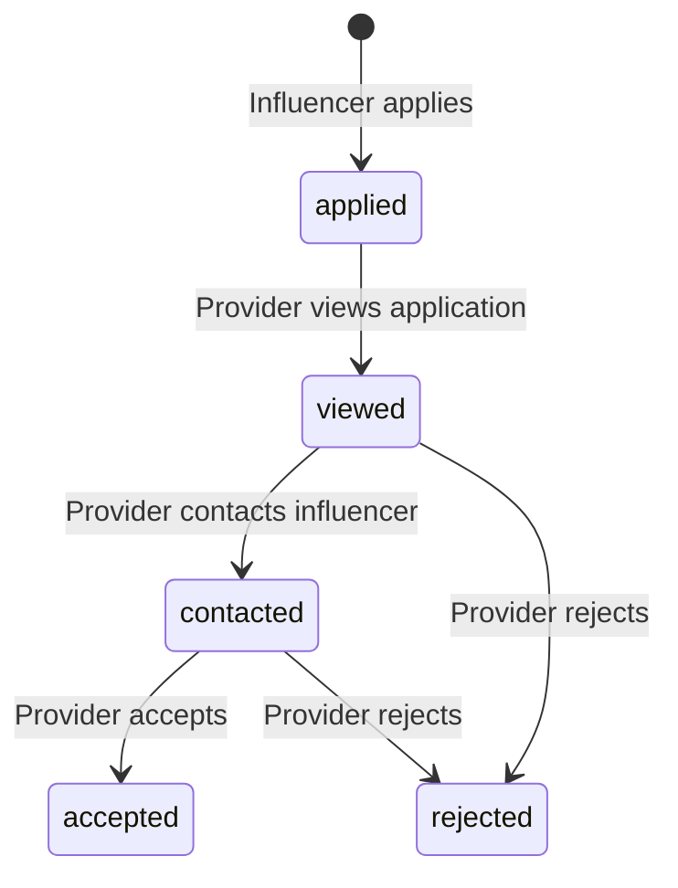

# Phase 3 — Opportunities & Connections

| Field | Value |
|---|---|
| Phase | 3 of 4 |
| Status | Draft |
| Stack | Next.js (App Router) + Supabase (Postgres + Edge Functions) |
| Duration | ~2–3 weeks |
| Depends on | Phase 2 (Profiles & Directories) |
| Unlocks | Phase 4 (Admin Panel & Automation) |

---

## 1. Objective

Enable **Providers to post Opportunities** (influencer recruitment ads) and **Influencers to discover and apply** to them. This phase connects both sides of the marketplace and delivers the core matchmaking functionality.

---

## 2. Scope

### In Scope

| Area | Deliverables |
|---|---|
| **Opportunities** | Full CRUD: create, edit, list, detail, close |
| **Applications** | Influencers express interest/apply; providers manage applicants |
| **Opportunity Discovery** | Public-ish directory for influencers with filters |
| **Expiry** | Opportunities auto-expire at `expires_at`; max 1-month window enforced |
| **Contact Flow** | Provider contacts influencer via WhatsApp/phone after application |
| **Notifications** | Basic: new application alert, approval/status notifications (email or in-app placeholder) |

### Out of Scope

- Pre-moderation/approval of Opportunities (they go live immediately)
- In-app chat (contact via WhatsApp/phone)
- Admin removal of Opportunities (Phase 4)
- Background job scheduler for auto-expiry (Phase 4 — manual/cron for now)

---

## 3. Database Schema

### 3.1 Opportunities

```sql
CREATE TABLE opportunities (
  id                   UUID PRIMARY KEY DEFAULT gen_random_uuid(),
  business_profile_id  UUID NOT NULL REFERENCES business_profiles(id) ON DELETE CASCADE,
  posted_by_user_id    UUID NOT NULL REFERENCES users(id),
  title                VARCHAR(150) NOT NULL,
  purpose              VARCHAR(200) NOT NULL,
  description          TEXT NOT NULL,
  price_min            NUMERIC(12,2) NOT NULL,
  price_max            NUMERIC(12,2) NOT NULL,
  currency             CHAR(3) NOT NULL DEFAULT 'INR',
  min_followers        INTEGER NOT NULL DEFAULT 0,
  platform_preference  VARCHAR(15) NOT NULL DEFAULT 'any'
                       CHECK (platform_preference IN ('instagram','youtube','facebook','any')),
  starts_at            TIMESTAMPTZ NOT NULL,
  expires_at           TIMESTAMPTZ NOT NULL,
  status               VARCHAR(15) NOT NULL DEFAULT 'draft'
                       CHECK (status IN ('draft','active','expired','closed','removed')),
  removed_reason       VARCHAR(500),
  created_at           TIMESTAMPTZ NOT NULL DEFAULT now(),
  updated_at           TIMESTAMPTZ NOT NULL DEFAULT now(),
  CHECK (expires_at > starts_at),
  CHECK (expires_at <= starts_at + INTERVAL '31 days'),
  CHECK (price_max >= price_min)
);

CREATE INDEX idx_opp_status_expires ON opportunities(status, expires_at);
CREATE INDEX idx_opp_business ON opportunities(business_profile_id);
CREATE INDEX idx_opp_followers ON opportunities(min_followers);
CREATE INDEX idx_opp_platform ON opportunities(platform_preference);
CREATE INDEX idx_opp_posted_by ON opportunities(posted_by_user_id);
```

### 3.2 Opportunity Applications

```sql
CREATE TABLE opportunity_applications (
  id                    BIGINT GENERATED ALWAYS AS IDENTITY PRIMARY KEY,
  opportunity_id        UUID NOT NULL REFERENCES opportunities(id) ON DELETE CASCADE,
  influencer_profile_id UUID NOT NULL REFERENCES influencer_profiles(id) ON DELETE CASCADE,
  message               TEXT,
  status                VARCHAR(15) NOT NULL DEFAULT 'applied'
                        CHECK (status IN ('applied','viewed','contacted','accepted','rejected')),
  created_at            TIMESTAMPTZ NOT NULL DEFAULT now(),
  updated_at            TIMESTAMPTZ NOT NULL DEFAULT now(),
  UNIQUE(opportunity_id, influencer_profile_id)
);

CREATE INDEX idx_oa_opportunity ON opportunity_applications(opportunity_id);
CREATE INDEX idx_oa_influencer ON opportunity_applications(influencer_profile_id);
CREATE INDEX idx_oa_status ON opportunity_applications(status);
```

---

## 4. Business Rules

### 4.1 Opportunity Posting Rules

| Rule | Constraint |
|---|---|
| Only from **approved** business profiles | Check `business_profiles.status = 'approved'` |
| Max duration: **1 month** (31 days) | `expires_at <= starts_at + 31 days` |
| Goes **live immediately** (no approval) | Status set to `active` on publish if `starts_at <= now()` |
| Scheduled start | If `starts_at > now()`, status = `draft` until starts_at |
| Auto-expire | Background job sets `status = 'expired'` when `expires_at < now()` |
| Provider can close early | `active → closed` (manual) |
| Admin can remove | `active → removed` (Phase 4) |

### 4.2 Application Rules

| Rule | Detail |
|---|---|
| Only published influencers can apply | Check `influencer_profiles.status = 'published'` |
| One application per opportunity | UNIQUE(opportunity_id, influencer_profile_id) |
| Only to active opportunities | Check `opportunities.status = 'active'` |
| Min followers gate | Compare influencer's total followers vs `min_followers` |
| Application message optional | Influencer can include a pitch message |

### 4.3 Application Status Flow



---

## 5. API Routes

### 5.1 Opportunities

| Method | Route | Auth | Purpose |
|---|---|---|---|
| `GET` | `/api/opportunities` | Influencer | List active opportunities (filtered, paginated) |
| `GET` | `/api/opportunities/[id]` | Authenticated | Opportunity detail |
| `POST` | `/api/opportunities` | Provider | Create opportunity (validates approved business profile + max duration) |
| `PATCH` | `/api/opportunities/[id]` | Owner | Update draft/active opportunity |
| `POST` | `/api/opportunities/[id]/close` | Owner | Close opportunity early |
| `DELETE` | `/api/opportunities/[id]` | Owner | Delete draft opportunity |
| `GET` | `/api/opportunities/my` | Provider | List provider's own opportunities |
| `GET` | `/api/opportunities/[id]/applications` | Owner (Provider) | List applications for an opportunity |

### 5.2 Applications

| Method | Route | Auth | Purpose |
|---|---|---|---|
| `POST` | `/api/opportunities/[id]/apply` | Influencer | Apply to an opportunity |
| `GET` | `/api/applications/my` | Influencer | List own applications |
| `PATCH` | `/api/applications/[id]/status` | Provider (opportunity owner) | Update application status |

---

## 6. UI/UX Specifications

### 6.1 Opportunities Directory (`/opportunities`) — Influencer View

**Layout — Desktop**: 2-column cards with left sidebar filters
**Layout — Mobile**: Full-width cards, filter as bottom sheet

**Filter Panel:**
- Platform: Instagram / YouTube / Facebook / Any
- Price range (min–max slider)
- Min followers threshold
- Location (state/city of the posting business)
- Category of posting business

**Opportunity Card:**
```
┌──────────────────────────────────────────┐
│  Business Logo/Image        ⏱ 5 days left│
│                                          │
│  Opportunity Title                       │
│  by Business Name                        │
│                                          │
│  Purpose (1 line)                        │
│                                          │
│  💰 ₹5,000 – ₹15,000                    │
│  📊 Min 10K followers                    │
│  📱 Instagram preferred                  │
│                                          │
│  [Apply Now]              [View Details] │
└──────────────────────────────────────────┘
```

- **Expiry countdown**: days remaining badge (amber < 3 days, red < 1 day)
- Platform preference: icon + text badge
- Price range: prominent, formatted with `Intl.NumberFormat`
- Follower gate: shows minimum with icon
- "Apply Now" → opens application modal (if eligible) or shows ineligibility reason
- Cards: hover lift effect, 200ms ease-out (`scale-feedback`)
- Lazy load below-fold cards (`lazy-load-below-fold`)

**Opportunity Detail Page (`/opportunities/[id]`):**
- Full description with rich text rendering
- Business profile card (mini view, linked)
- Requirements section (platform, min followers, price range)
- Timeline section (started, expires, days remaining)
- Application form: message textarea + submit
- If already applied: show application status badge
- Breadcrumb: Opportunities → [Title]

### 6.2 Application Modal

```
┌──────────────────────────────────────┐
│  Apply to: {Opportunity Title}        │
│                                       │
│  Your Profile:                        │
│  [Profile picture] Display Name       │
│  IG: 25K · YT: 10K                   │
│                                       │
│  Message (optional):                  │
│  ┌─────────────────────────────────┐ │
│  │ Write a pitch to the provider...│ │
│  │                                 │ │
│  └─────────────────────────────────┘ │
│                                       │
│  [Cancel]              [Submit Apply] │
└──────────────────────────────────────┘
```

- Modal: animate from trigger button, scale+fade 250ms (`modal-motion`)
- `aria-modal`, focus trap, Escape to close (`escape-routes`)
- Submit button: loading state during API call (`loading-buttons`)
- Success: green checkmark animation + auto-close after 2s (`success-feedback`)
- Error: inline error below message field (`error-placement`)

### 6.3 Provider — Manage Opportunities (`/dashboard/opportunities`)

**My Opportunities List:**
- Tab filters: All | Active | Draft | Expired | Closed
- Each row: Title, Business Profile name, Status badge, Applications count, Expires date
- Actions: Edit (draft), Close (active), View Applications, Delete (draft)
- Empty state: "Post your first opportunity to recruit influencers" (`empty-states`)

**Create/Edit Opportunity (`/dashboard/opportunities/new`):**
- Form fields:
  - Select business profile (only approved ones)
  - Title, purpose, description (rich text)
  - Price range (min/max inputs)
  - Min followers (number input)
  - Platform preference (radio: Instagram/YouTube/Facebook/Any)
  - Date range picker (starts_at, expires_at) — validates ≤ 31 days
- Inline validation on blur
- Character counter on title (150) and purpose (200)
- Date picker: disables past dates, shows max end date dynamically
- Save as Draft + Publish buttons

**View Applications (`/dashboard/opportunities/[id]/applications`):**
- Application cards with influencer preview:
  - Profile picture, display name, follower counts
  - Application message (expandable)
  - Status badge: Applied (blue), Viewed (gray), Contacted (amber), Accepted (green), Rejected (red)
  - Actions: View Full Profile, Contact (WhatsApp), Accept, Reject
- Bulk status transitions not supported v1 — individual only
- Contact button: opens WhatsApp + logs reveal + updates status to `contacted`

### 6.4 Influencer — My Applications (`/dashboard/applications`)

- List of own applications with status
- Each row: Opportunity title, Business name, Applied date, Status badge
- Click → view opportunity detail
- Status updates in near-real-time (poll every 30s or use Supabase Realtime)

---

## 7. Opportunity Expiry Handling

### Phase 3 — Temporary Approach
Use a **Supabase Edge Function** triggered by a **pg_cron** extension job:

```sql
-- Enable pg_cron (run once in Supabase SQL editor)
CREATE EXTENSION IF NOT EXISTS pg_cron;

-- Schedule every 15 minutes
SELECT cron.schedule(
  'expire-opportunities',
  '*/15 * * * *',
  $$UPDATE opportunities SET status = 'expired', updated_at = now()
    WHERE status = 'active' AND expires_at < now()$$
);
```

### Phase 4 — Proper Background Jobs
Moved to dedicated job worker with notification support.

---

## 8. Row-Level Security

```sql
ALTER TABLE opportunities ENABLE ROW LEVEL SECURITY;

-- Public: read active opportunities
CREATE POLICY "Read active" ON opportunities
  FOR SELECT USING (status = 'active');

-- Owner: read all own
CREATE POLICY "Owner read own" ON opportunities
  FOR SELECT USING (auth.uid() = posted_by_user_id);

-- Provider: create (must own an approved business profile)
CREATE POLICY "Provider create" ON opportunities
  FOR INSERT WITH CHECK (
    auth.uid() = posted_by_user_id
    AND EXISTS (
      SELECT 1 FROM business_profiles
      WHERE id = business_profile_id
      AND user_id = auth.uid()
      AND status = 'approved'
    )
  );

-- Owner: update own
CREATE POLICY "Owner update" ON opportunities
  FOR UPDATE USING (auth.uid() = posted_by_user_id);

-- Applications
ALTER TABLE opportunity_applications ENABLE ROW LEVEL SECURITY;

-- Influencer: insert own application
CREATE POLICY "Influencer apply" ON opportunity_applications
  FOR INSERT WITH CHECK (
    EXISTS (
      SELECT 1 FROM influencer_profiles
      WHERE id = influencer_profile_id AND user_id = auth.uid()
    )
  );

-- Influencer: read own applications
CREATE POLICY "Read own applications" ON opportunity_applications
  FOR SELECT USING (
    EXISTS (
      SELECT 1 FROM influencer_profiles
      WHERE id = influencer_profile_id AND user_id = auth.uid()
    )
  );

-- Provider: read applications to own opportunities
CREATE POLICY "Provider read applications" ON opportunity_applications
  FOR SELECT USING (
    EXISTS (
      SELECT 1 FROM opportunities
      WHERE id = opportunity_id AND posted_by_user_id = auth.uid()
    )
  );

-- Provider: update application status
CREATE POLICY "Provider update status" ON opportunity_applications
  FOR UPDATE USING (
    EXISTS (
      SELECT 1 FROM opportunities
      WHERE id = opportunity_id AND posted_by_user_id = auth.uid()
    )
  );
```

---

## 9. Acceptance Criteria

| ID | Criterion |
|---|---|
| P3-AC01 | Provider can create opportunity only from approved business profile |
| P3-AC02 | Duration validation: max 31 days enforced (client + DB) |
| P3-AC03 | Opportunity goes `active` immediately if `starts_at <= now()` |
| P3-AC04 | Active opportunities visible in `/opportunities` directory |
| P3-AC05 | Influencer can apply once per opportunity with optional message |
| P3-AC06 | Influencer below `min_followers` cannot apply (shown reason) |
| P3-AC07 | Provider sees applications list with influencer preview |
| P3-AC08 | Application status transitions work correctly |
| P3-AC09 | Contact via WhatsApp logs reveal + updates status |
| P3-AC10 | Auto-expiry runs every 15 min via pg_cron |
| P3-AC11 | Expired opportunities no longer shown in directory |
| P3-AC12 | Provider can close opportunity early |
| P3-AC13 | Influencer's application list shows current status |
| P3-AC14 | Application modal: proper focus trap, escape close, loading states |
| P3-AC15 | All pages responsive on 375px viewport |
| P3-AC16 | Filters work correctly with pagination |

---

## 10. Risks & Mitigations

| Risk | Impact | Mitigation |
|---|---|---|
| pg_cron availability in Supabase | Expiry doesn't run | Fallback: filter by `expires_at` in queries; cron as Phase 4 |
| Spam opportunity postings | Low-quality listings | Rate limit: max 10 active per business profile |
| Influencer applies to irrelevant opportunities | Provider frustration | Clear eligibility display; platform preference matching |
| Application status not synced in real-time | Stale UI | Supabase Realtime subscription or 30s polling |

---

*Previous → [Phase 2: Profiles & Directories](./Phase_2_Profiles_Directories.md)*
*Next → [Phase 4: Admin Panel & Automation](./Phase_4_Admin_Automation.md)*
