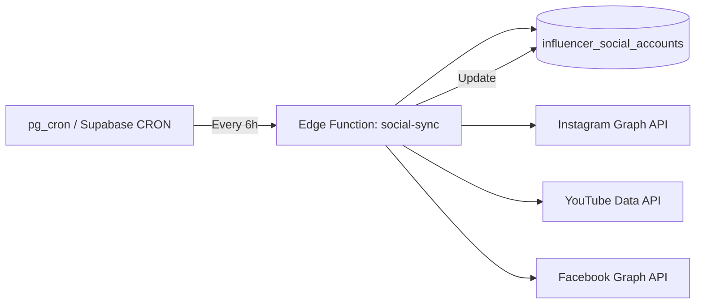

# Phase 4 — Admin Panel & Automation

| Field | Value |
|---|---|
| Phase | 4 of 4 |
| Status | Draft |
| Stack | Next.js (App Router) + Supabase (Postgres + Edge Functions + Realtime) |
| Duration | ~3–4 weeks |
| Depends on | Phase 3 (Opportunities & Connections) |
| Unlocks | Production launch readiness |

---

## 1. Objective

Deliver the **Admin Panel** for platform governance, implement **background automation** (social sync, expiry, notifications), and add the **audit trail** — completing the platform for production launch.

---

## 2. Scope

### In Scope

| Area | Deliverables |
|---|---|
| **Admin Panel** | Separate app shell under `/admin` route group with full RBAC |
| **Dashboard** | Counts: pending approvals, active listings, users, opportunities |
| **Approval Workflow** | Review queue for business profiles: approve/reject with reason |
| **User Management** | Search, suspend/reactivate users, grant/revoke roles |
| **Content Moderation** | Suspend business/influencer profiles, remove opportunities |
| **Category Management** | CRUD categories, deactivate, merge |
| **Platform Config** | Edit `platform_config` key-value settings |
| **Audit Log** | Immutable `admin_audit_log` with browse/filter UI |
| **Social Sync** | Background job: auto-fetch follower counts from Instagram/YouTube/Facebook APIs |
| **Notifications** | Approval/rejection notifications; opportunity expiry reminders |
| **Background Jobs** | Proper job scheduler replacing Phase 3 pg_cron |

### Out of Scope (v1)

- In-app payments / escrow
- In-app chat
- Ratings & reviews
- Advanced analytics / BI dashboards

---

## 3. Database Schema

### 3.1 Admin Audit Log

```sql
CREATE TABLE admin_audit_log (
  id             BIGINT GENERATED ALWAYS AS IDENTITY PRIMARY KEY,
  admin_user_id  UUID NOT NULL REFERENCES users(id),
  action         VARCHAR(80) NOT NULL,
  entity_type    VARCHAR(60) NOT NULL,
  entity_id      VARCHAR(80) NOT NULL,
  metadata       JSONB,
  created_at     TIMESTAMPTZ NOT NULL DEFAULT now()
);

CREATE INDEX idx_aal_admin ON admin_audit_log(admin_user_id);
CREATE INDEX idx_aal_entity ON admin_audit_log(entity_type, entity_id);
CREATE INDEX idx_aal_created ON admin_audit_log(created_at DESC);
```

### 3.2 Notifications Table (optional — for in-app notifications)

```sql
CREATE TABLE notifications (
  id          BIGINT GENERATED ALWAYS AS IDENTITY PRIMARY KEY,
  user_id     UUID NOT NULL REFERENCES users(id) ON DELETE CASCADE,
  type        VARCHAR(50) NOT NULL,
  title       VARCHAR(200) NOT NULL,
  body        TEXT,
  data        JSONB,
  is_read     BOOLEAN NOT NULL DEFAULT false,
  created_at  TIMESTAMPTZ NOT NULL DEFAULT now()
);

CREATE INDEX idx_notif_user_unread ON notifications(user_id, is_read) WHERE NOT is_read;
```

---

## 4. Admin Panel Architecture

### 4.1 Route Structure

```
src/app/
├── (admin)/
│   ├── layout.tsx              -- Admin shell: sidebar + topbar
│   ├── admin/
│   │   ├── page.tsx            -- Dashboard
│   │   ├── approvals/
│   │   │   └── page.tsx        -- Business profile approval queue
│   │   ├── business-profiles/
│   │   │   ├── page.tsx        -- All business profiles
│   │   │   └── [id]/page.tsx   -- Profile detail + actions
│   │   ├── influencers/
│   │   │   ├── page.tsx        -- All influencer profiles
│   │   │   └── [id]/page.tsx   -- Profile detail + actions
│   │   ├── opportunities/
│   │   │   ├── page.tsx        -- All opportunities
│   │   │   └── [id]/page.tsx   -- Opportunity detail + actions
│   │   ├── users/
│   │   │   ├── page.tsx        -- User management
│   │   │   └── [id]/page.tsx   -- User detail + role management
│   │   ├── categories/
│   │   │   └── page.tsx        -- Category CRUD
│   │   ├── config/
│   │   │   └── page.tsx        -- Platform configuration
│   │   └── audit-log/
│   │       └── page.tsx        -- Audit trail browser
```

### 4.2 Admin Auth Guard

```typescript
// middleware.ts — protect /admin routes
export async function middleware(request: NextRequest) {
  if (request.nextUrl.pathname.startsWith('/admin')) {
    const supabase = createMiddlewareClient({ req: request });
    const { data: { session } } = await supabase.auth.getSession();

    if (!session) return redirect('/login');

    const { data: roles } = await supabase
      .from('user_roles')
      .select('role')
      .eq('user_id', session.user.id)
      .eq('role', 'admin');

    if (!roles?.length) return redirect('/dashboard');
  }
}
```

---

## 5. Admin Panel UI Modules

### 5.1 Dashboard (`/admin`)

**Layout**: Bento grid with stat cards + quick-action panels

**Stat Cards (top row):**
| Card | Query | Color |
|---|---|---|
| Pending Approvals | `business_profiles WHERE status='pending_approval'` | Amber |
| Active Services | `business_profiles WHERE status='approved'` | Green |
| Total Users | `users WHERE status='active'` | Primary |
| Active Opportunities | `opportunities WHERE status='active'` | Secondary |

**Quick Action Panels:**
- Recent pending approvals (last 5) with one-click approve/reject
- Recent user signups (last 10)
- Opportunities expiring in 24h
- Recent audit log entries (last 10)

**Design:**
- Cards: subtle glassmorphism with backdrop-blur
- Numbers: `tabular-nums` font variant for alignment (`number-tabular`)
- Auto-refresh every 60s or Supabase Realtime subscription
- Responsive: 2-column on tablet, stack on mobile

### 5.2 Approvals Queue (`/admin/approvals`)

**Layout**: Full-width table/list with preview panel

**Queue columns:**
| Column | Content |
|---|---|
| Business Name | Linked to detail view |
| Provider | User name + profile link |
| Category | Badge |
| Submitted | Relative time (e.g., "2 hours ago") |
| Actions | Approve (green), Reject (red) |

**Review Detail (slide-over panel or page):**
- Full business profile preview (as public would see it)
- Submitted media gallery
- Provider info: user name, other profiles, join date
- Previous approval history (`profile_approvals`)
- Action buttons:
  - **Approve**: single click, confirmation dialog (`confirmation-dialogs`)
  - **Reject**: opens textarea for rejection reason (required), then confirm

**UX rules:**
- Approve button: green, primary prominence (`primary-action`)
- Reject button: red outline, secondary — separated visually (`destructive-emphasis`)
- Success toast on action: "Profile approved" / "Profile rejected" — 3s auto-dismiss (`toast-dismiss`)
- All actions write to `admin_audit_log` and `profile_approvals`

### 5.3 Business Profiles (`/admin/business-profiles`)

- Searchable table: Business Name, Provider, Category, City, Status, Created
- Status filter tabs: All | Approved | Pending | Rejected | Suspended
- Actions per profile:
  - **Suspend** (approved → suspended) — requires reason
  - **Reactivate** (suspended → approved)
  - **View as Public** — opens public preview
- Approval history timeline on detail page

### 5.4 Influencer Profiles (`/admin/influencers`)

- Searchable table: Display Name, Niche, City, Followers (total), Status
- **No approval workflow** — influencers self-publish
- Actions:
  - **Suspend** (published → suspended) — requires reason
  - **Reactivate** (suspended → published)
  - View social accounts + follower counts + verification status

### 5.5 Opportunities (`/admin/opportunities`)

- Searchable table: Title, Business, Status, Applications count, Expires
- Status filter tabs: All | Active | Expired | Closed | Removed
- Actions:
  - **Remove** (active → removed) — requires reason
  - View applications summary

### 5.6 Users & Roles (`/admin/users`)

- Searchable table: Name, Mobile, City, Roles (badges), Status, Joined
- User detail page:
  - User info + edit capability
  - Current roles with add/remove
  - Related profiles (business + influencer)
  - Activity: recent opportunities, applications
- Actions:
  - **Suspend** / **Reactivate** user account
  - **Grant** / **Revoke** roles (including `admin`)
  - Granting admin: requires confirmation dialog with extra warning

### 5.7 Categories (`/admin/categories`)

- Tree view showing parent-child hierarchy
- CRUD:
  - Create: name, slug (auto-generated), parent (optional)
  - Edit: name, slug, parent, active toggle
  - Deactivate: soft-delete (sets `is_active = false`)
  - Merge: select source → target, reassign all profiles
- Drag-and-drop reordering (optional — sort_order field)

### 5.8 Platform Configuration (`/admin/config`)

- Key-value list with descriptions
- Inline editing: click value → input → save
- Current values:
  - `max_business_profiles_per_provider`: 5
  - `max_opportunity_duration_days`: 30
- Validation: numeric values only where expected
- Change logged to audit trail

### 5.9 Audit Log (`/admin/audit-log`)

- Table: Admin User, Action, Entity Type, Entity ID, Timestamp
- Filters: admin user, action type, entity type, date range
- Detail: expand row to see `metadata` JSON (before/after)
- Immutable: no edit/delete actions
- Paginated: 50 rows per page
- Sort: newest first (default)

---

## 6. Admin API Routes

| Method | Route | Purpose |
|---|---|---|
| `GET` | `/api/admin/dashboard` | Dashboard stats |
| `GET` | `/api/admin/business-profiles` | List all (filtered) |
| `POST` | `/api/admin/business-profiles/[id]/approve` | Approve profile |
| `POST` | `/api/admin/business-profiles/[id]/reject` | Reject (+ reason) |
| `POST` | `/api/admin/business-profiles/[id]/suspend` | Suspend profile |
| `POST` | `/api/admin/business-profiles/[id]/reactivate` | Reactivate |
| `POST` | `/api/admin/influencers/[id]/suspend` | Suspend influencer |
| `POST` | `/api/admin/influencers/[id]/reactivate` | Reactivate |
| `POST` | `/api/admin/opportunities/[id]/remove` | Remove opportunity |
| `GET` | `/api/admin/users` | List users (filtered) |
| `POST` | `/api/admin/users/[id]/suspend` | Suspend user |
| `POST` | `/api/admin/users/[id]/reactivate` | Reactivate user |
| `POST` | `/api/admin/users/[id]/roles` | Grant role |
| `DELETE` | `/api/admin/users/[id]/roles/[role]` | Revoke role |
| `GET/POST/PATCH` | `/api/admin/categories` | Category CRUD |
| `POST` | `/api/admin/categories/merge` | Merge categories |
| `GET/PATCH` | `/api/admin/config` | Platform config |
| `GET` | `/api/admin/audit-log` | Browse audit trail |

**All admin endpoints:**
- Require JWT with `admin` role
- Write to `admin_audit_log` on every state-changing action
- Return consistent error responses

---

## 7. Audit Logging Implementation

```typescript
// lib/audit.ts
async function logAdminAction(
  supabase: SupabaseClient,
  adminUserId: string,
  action: string,
  entityType: string,
  entityId: string,
  metadata?: Record<string, unknown>
) {
  await supabase.from('admin_audit_log').insert({
    admin_user_id: adminUserId,
    action,
    entity_type: entityType,
    entity_id: entityId,
    metadata: metadata ?? {},
  });
}

// Usage in approve endpoint:
await logAdminAction(supabase, adminId, 'approve_business_profile',
  'business_profile', profileId, { previous_status: 'pending_approval' });
```

**Audit actions catalog:**

| Action | Entity Type |
|---|---|
| `approve_business_profile` | `business_profile` |
| `reject_business_profile` | `business_profile` |
| `suspend_business_profile` | `business_profile` |
| `reactivate_business_profile` | `business_profile` |
| `suspend_influencer_profile` | `influencer_profile` |
| `reactivate_influencer_profile` | `influencer_profile` |
| `remove_opportunity` | `opportunity` |
| `suspend_user` | `user` |
| `reactivate_user` | `user` |
| `grant_role` | `user_role` |
| `revoke_role` | `user_role` |
| `create_category` | `category` |
| `update_category` | `category` |
| `merge_category` | `category` |
| `update_config` | `platform_config` |

---

## 8. Background Jobs & Automation

### 8.1 Social Sync Service

**Purpose**: Auto-fetch follower/subscriber counts from social platform APIs.

**Architecture:**


**Logic:**
1. Query `influencer_social_accounts WHERE count_source = 'auto' AND (last_synced_at < now() - interval '6 hours' OR last_synced_at IS NULL)`
2. For each account, call the respective API
3. Update `follower_count`, `is_verified = true`, `last_synced_at = now()`
4. On API failure: skip, log error, try next cycle
5. Rate limit: max 100 accounts per batch

**API Requirements:**
| Platform | API | Auth | Endpoint |
|---|---|---|---|
| Instagram | Graph API v18+ | User OAuth token | `/me?fields=followers_count` |
| YouTube | Data API v3 | API key | `/channels?part=statistics&id={channelId}` |
| Facebook | Graph API | Page token | `/{page-id}?fields=followers_count` |

**Fallback:** If OAuth not connected, `count_source` stays `manual` and `is_verified = false`.

### 8.2 Opportunity Expiry (upgraded from Phase 3)

Replace pg_cron inline SQL with a proper Edge Function:

```sql
-- pg_cron triggers Edge Function
SELECT cron.schedule('expire-opportunities', '*/15 * * * *',
  $$SELECT net.http_post(
    url := 'https://<project>.supabase.co/functions/v1/expire-opportunities',
    headers := '{"Authorization": "Bearer <service-role-key>"}'::jsonb
  )$$
);
```

**Edge Function logic:**
1. `UPDATE opportunities SET status='expired' WHERE status='active' AND expires_at < now()`
2. For each expired: create notification for the provider
3. Return count of expired opportunities

### 8.3 Notification Service

**Types:**
| Event | Recipient | Channel |
|---|---|---|
| Business profile approved | Provider | In-app + SMS (optional) |
| Business profile rejected | Provider | In-app + SMS (optional) |
| New application received | Provider | In-app |
| Application status updated | Influencer | In-app |
| Opportunity expiring (24h) | Provider | In-app |
| Opportunity expired | Provider | In-app |

**In-app notifications:**
- Bell icon in navbar with unread count badge
- Dropdown panel showing recent notifications
- Mark as read on click
- "Mark all read" action
- Supabase Realtime subscription for live updates

---

## 9. Admin Panel Design System

### 9.1 Layout

```
┌──────────────────────────────────────────────────┐
│  [Logo]  Admin Panel         🔔  👤 Admin Name  ▾ │
├──────────┬───────────────────────────────────────┤
│          │                                       │
│  📊 Dash │  Main Content Area                    │
│  ✅ Appro│                                       │
│  🏢 Biz  │  [Breadcrumb: Admin > Approvals]     │
│  👤 Influ│                                       │
│  📢 Opps │  Content...                           │
│  👥 Users│                                       │
│  📁 Cats │                                       │
│  ⚙ Config│                                       │
│  📋 Audit│                                       │
│          │                                       │
├──────────┴───────────────────────────────────────┤
│  © Graphitex Digitals                             │
└──────────────────────────────────────────────────┘
```

- **Sidebar**: 240px, collapsible on mobile → hamburger menu
- **Icons**: Lucide icon set (consistent, SVG-based — `no-emoji-icons`)
- **Active nav item**: primary color highlight + left border indicator
- **Topbar**: 64px height, user avatar + dropdown menu
- Mobile: sidebar becomes overlay drawer

### 9.2 Admin Color Overrides

| Token | Value | Rationale |
|---|---|---|
| **Admin Primary** | `hsl(220, 70%, 50%)` | Distinct from public primary to differentiate admin context |
| **Admin Surface** | `hsl(220, 15%, 97%)` light / `hsl(220, 18%, 10%)` dark | Slightly cooler tone |
| **Approval Green** | `hsl(145, 63%, 42%)` | Clear approve action color |
| **Rejection Red** | `hsl(0, 72%, 51%)` | Clear reject/remove action color |
| **Pending Amber** | `hsl(38, 92%, 50%)` | Pending status indicator |

### 9.3 Table Components

- Sortable columns with `aria-sort` (`sortable-table`)
- Row hover highlight
- Pagination: 20/50/100 rows per page selector
- Empty state: illustration + message (`empty-states`)
- Loading: skeleton rows (`loading-states`)
- Sticky header on scroll
- Responsive: horizontal scroll on mobile with sticky first column

---

## 10. Row-Level Security (Admin)

```sql
-- Admin audit log: admin insert, admin read
ALTER TABLE admin_audit_log ENABLE ROW LEVEL SECURITY;

CREATE POLICY "Admin insert" ON admin_audit_log
  FOR INSERT WITH CHECK (
    EXISTS (SELECT 1 FROM user_roles WHERE user_id = auth.uid() AND role = 'admin')
  );

CREATE POLICY "Admin read" ON admin_audit_log
  FOR SELECT USING (
    EXISTS (SELECT 1 FROM user_roles WHERE user_id = auth.uid() AND role = 'admin')
  );

-- Admin access to all business profiles
CREATE POLICY "Admin read all business profiles" ON business_profiles
  FOR SELECT USING (
    EXISTS (SELECT 1 FROM user_roles WHERE user_id = auth.uid() AND role = 'admin')
  );

CREATE POLICY "Admin update business profiles" ON business_profiles
  FOR UPDATE USING (
    EXISTS (SELECT 1 FROM user_roles WHERE user_id = auth.uid() AND role = 'admin')
  );

-- Admin access to all influencer profiles
CREATE POLICY "Admin read all influencer profiles" ON influencer_profiles
  FOR SELECT USING (
    EXISTS (SELECT 1 FROM user_roles WHERE user_id = auth.uid() AND role = 'admin')
  );

CREATE POLICY "Admin update influencer profiles" ON influencer_profiles
  FOR UPDATE USING (
    EXISTS (SELECT 1 FROM user_roles WHERE user_id = auth.uid() AND role = 'admin')
  );

-- Admin: read all users
CREATE POLICY "Admin read all users" ON users
  FOR SELECT USING (
    EXISTS (SELECT 1 FROM user_roles WHERE user_id = auth.uid() AND role = 'admin')
  );

CREATE POLICY "Admin update users" ON users
  FOR UPDATE USING (
    EXISTS (SELECT 1 FROM user_roles WHERE user_id = auth.uid() AND role = 'admin')
  );

-- Notifications
ALTER TABLE notifications ENABLE ROW LEVEL SECURITY;
CREATE POLICY "Read own notifications" ON notifications
  FOR SELECT USING (auth.uid() = user_id);
CREATE POLICY "Update own notifications" ON notifications
  FOR UPDATE USING (auth.uid() = user_id);
```

---

## 11. Acceptance Criteria

| ID | Criterion |
|---|---|
| P4-AC01 | Admin panel accessible only to users with `admin` role |
| P4-AC02 | Dashboard shows correct counts (pending, active, users, opportunities) |
| P4-AC03 | Admin can approve business profile → status = `approved`, appears in directory |
| P4-AC04 | Admin can reject with reason → status = `rejected`, provider notified |
| P4-AC05 | Admin can suspend/reactivate business profiles, influencer profiles, users |
| P4-AC06 | Admin can remove opportunities with reason |
| P4-AC07 | Admin can grant/revoke all roles including `admin` |
| P4-AC08 | Category CRUD works: create, edit, deactivate, merge |
| P4-AC09 | Platform config editable and changes take effect immediately |
| P4-AC10 | All admin actions logged to `admin_audit_log` |
| P4-AC11 | Audit log browsable with filters (admin, action, entity, date) |
| P4-AC12 | Social sync updates follower counts for `auto` accounts |
| P4-AC13 | Manual follower counts flagged as unverified |
| P4-AC14 | Opportunity expiry job runs every 15 min |
| P4-AC15 | In-app notifications delivered for approval/rejection/applications |
| P4-AC16 | Admin panel responsive on tablet (768px+) |
| P4-AC17 | Confirmation dialogs on all destructive actions |
| P4-AC18 | Admin panel uses Lucide SVG icons (no emojis) |

---

## 12. Third-Party Integration Summary

| Integration | Phase | Status |
|---|---|---|
| **Supabase Auth (Phone OTP)** | Phase 1 | Required |
| **Supabase Storage** | Phase 2 | Required |
| **Supabase Realtime** | Phase 3–4 | Recommended |
| **Supabase Edge Functions** | Phase 4 | Required |
| **pg_cron** | Phase 3–4 | Required |
| **Instagram Graph API** | Phase 4 | Optional (manual fallback) |
| **YouTube Data API** | Phase 4 | Optional (manual fallback) |
| **Facebook Graph API** | Phase 4 | Optional (manual fallback) |
| **SMS Gateway** | Phase 1 | Required (via Supabase) |
| **WhatsApp Click-to-Chat** | Phase 2 | `wa.me` deep links |

---

## 13. Risks & Mitigations

| Risk | Impact | Mitigation |
|---|---|---|
| Social API rate limits | Sync failures | Batch processing, exponential backoff, skip on failure |
| OAuth token expiry | Auto-sync stops | Token refresh flow; alert admin; fallback to manual |
| Admin role abuse | Security breach | Audit logging, require MFA for admin, grant requires confirmation |
| Edge Function cold starts | Slow background jobs | Warm-up strategy; non-blocking for users |
| Notification spam | User annoyance | Rate limits, user preference settings (future) |

---

## 14. Launch Checklist

- [ ] All 4 phase acceptance criteria passing
- [ ] RLS policies reviewed and penetration tested
- [ ] Admin account seeded with initial admin user
- [ ] Seed data loaded: countries, states, cities, categories
- [ ] Platform config defaults verified
- [ ] Social API keys configured (or manual-only mode)
- [ ] SMS provider configured and tested
- [ ] Supabase Storage buckets created with policies
- [ ] Edge Functions deployed
- [ ] pg_cron jobs scheduled
- [ ] Performance: directory pages < 300ms P95
- [ ] Mobile responsive: tested on 375px, 768px, 1024px
- [ ] Accessibility: contrast ratios verified, keyboard nav tested
- [ ] Error handling: all API errors return meaningful messages
- [ ] CORS and security headers configured

---

*Previous → [Phase 3: Opportunities & Connections](./Phase_3_Opportunities.md)*
*See also → [Phase Overview](./Phase_Overview.md)*
