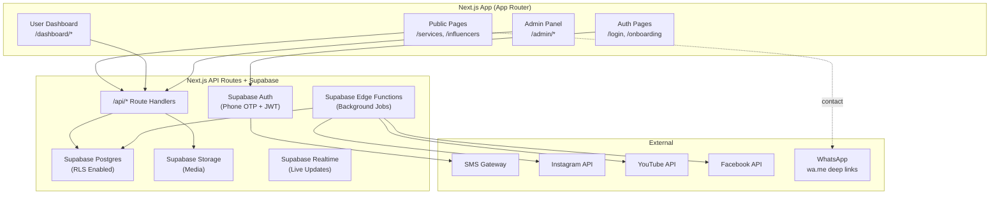
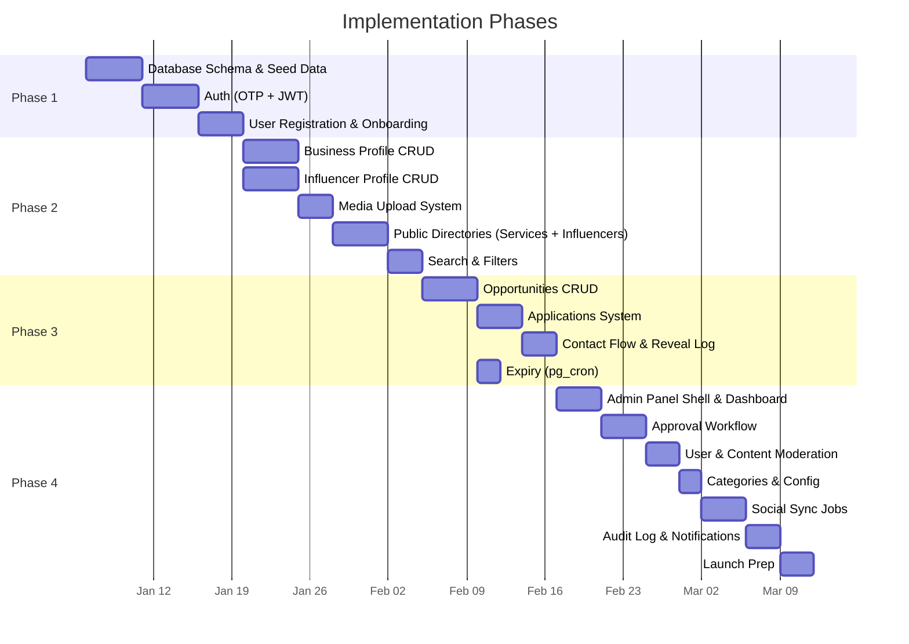

# Influencer–Provider Marketplace — Phased Implementation Plan

| Field | Value |
|---|---|
| Document type | Master Phase Overview |
| Version | 1.0 |
| Stack | **Next.js** (App Router) + **Supabase** (Postgres, Auth, Storage, Edge Functions, Realtime) |
| Total Duration | ~10–14 weeks |
| UI/UX Framework | ui-ux-pro-max skill guidelines |

---

## Architecture Summary

---

## Phase Roadmap

---

## Phase Summary

| Phase | Title | Duration | Key Deliverables | Dependencies |
|---|---|---|---|---|
| [**Phase 1**](./Phase_1_Foundation.md) | Foundation & Auth | 2–3 weeks | DB schema, OTP auth, user registration, multi-role, reference data, RLS | — |
| [**Phase 2**](./Phase_2_Profiles_Directories.md) | Profiles & Directories | 3–4 weeks | Business profiles, influencer profiles, media upload, public directories, search/filter | Phase 1 |
| [**Phase 3**](./Phase_3_Opportunities.md) | Opportunities & Connections | 2–3 weeks | Opportunity CRUD, applications, contact flow, expiry handling | Phase 2 |
| [**Phase 4**](./Phase_4_Admin_Automation.md) | Admin Panel & Automation | 3–4 weeks | Admin panel, approvals, moderation, social sync, notifications, audit log | Phase 3 |

---

## Database Tables by Phase

| Phase | Tables Created |
|---|---|
| **1** | `countries`, `states`, `cities`, `categories`, `users`, `user_roles`, `otp_verifications`, `platform_config` |
| **2** | `business_profiles`, `business_media`, `profile_approvals`, `influencer_profiles`, `influencer_social_accounts`, `contact_reveal_log` |
| **3** | `opportunities`, `opportunity_applications` |
| **4** | `admin_audit_log`, `notifications` |

**Total: 16 tables**

---

## User Roles Matrix

| Capability | Visitor | Customer | Influencer | Provider | Admin |
|---|---|---|---|---|---|
| Browse Services | ✅ | ✅ | ✅ | ✅ | ✅ |
| Browse Influencers | ✅ | ✅ | ✅ | ✅ | ✅ |
| Contact business (WhatsApp) | ✅ | ✅ | ✅ | ✅ | ✅ |
| View influencer contact | ❌ | ❌ | ❌ | ✅ | ✅ |
| Create business profile | ❌ | ❌ | ❌ | ✅ | ❌ |
| Create influencer profile | ❌ | ❌ | ✅ | ❌ | ❌ |
| Post opportunities | ❌ | ❌ | ❌ | ✅ | ❌ |
| Apply to opportunities | ❌ | ❌ | ✅ | ❌ | ❌ |
| Browse opportunities | ❌ | ❌ | ✅ | ✅ | ✅ |
| Approve/reject profiles | ❌ | ❌ | ❌ | ❌ | ✅ |
| Manage users/roles | ❌ | ❌ | ❌ | ❌ | ✅ |
| Manage categories/config | ❌ | ❌ | ❌ | ❌ | ✅ |

---

## Design System Quick Reference

| Property | Value |
|---|---|
| **Fonts** | Inter (body) + Outfit (headings) — Google Fonts |
| **Spacing** | 4px base increments (4/8/12/16/24/32/48) |
| **Radius** | 8px cards, 12px modals, 9999px pills |
| **Breakpoints** | 375 / 768 / 1024 / 1440 px |
| **Max width** | 1280px content container |
| **Color mode** | Dark-first with light toggle |
| **Icons** | Lucide (SVG, consistent stroke) |
| **Animations** | 150–300ms, ease-out enter / ease-in exit |
| **Touch targets** | ≥44×44px |
| **Contrast** | ≥4.5:1 body text, ≥3:1 secondary |

---

## Key Architectural Decisions

| Decision | Choice | Rationale |
|---|---|---|
| **Framework** | Next.js App Router | SSR for public SEO, API routes as backend, single deploy |
| **Database** | Supabase Postgres | Managed, RLS built-in, realtime, auth, storage |
| **Auth** | Supabase Phone OTP | Native phone auth, JWT sessions, no custom auth server |
| **Media storage** | Supabase Storage | Integrated with auth, CDN-ready, presigned uploads |
| **Background jobs** | pg_cron + Edge Functions | No separate worker infra needed at v1 scale |
| **Admin panel** | Same Next.js app, `/admin` route group | Single codebase, shared types, faster development |
| **Styling** | CSS Modules + CSS variables | Design tokens as CSS custom properties, no framework lock-in |
| **State management** | React Server Components + client hooks | Minimize client JS, server-first rendering |

---

*Detailed phase documents:*
1. [Phase 1: Foundation & Authentication](./Phase_1_Foundation.md)
2. [Phase 2: Profiles & Directories](./Phase_2_Profiles_Directories.md)
3. [Phase 3: Opportunities & Connections](./Phase_3_Opportunities.md)
4. [Phase 4: Admin Panel & Automation](./Phase_4_Admin_Automation.md)
